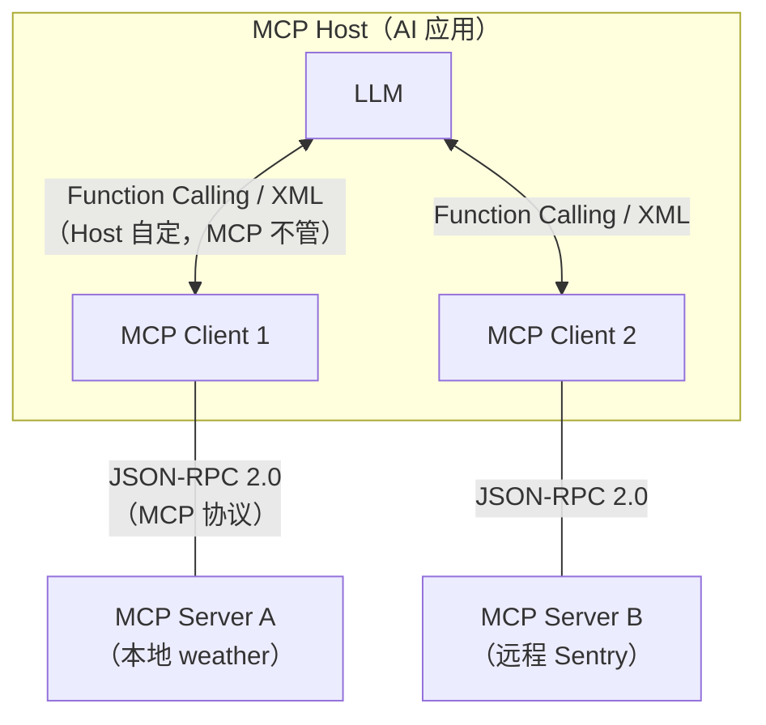

# MCP

**MCP**（Model Context Protocol，模型上下文协议）是一个开源标准，用于把 AI 应用连接到外部系统。借助 MCP，Claude、ChatGPT、Cursor 等 AI 应用可以访问数据源（本地文件、数据库）、工具（搜索引擎、计算器）和工作流（专用提示词模板），从而获取关键信息并执行实际任务。

可以把 MCP 理解为 AI 应用的 **USB-C 接口**：就像 USB-C 为电子设备提供统一的连接方式，MCP 为 AI 应用连接外部系统提供了统一标准。一次编写 MCP Server，即可在 Cursor、Claude Desktop、VS Code 等多个 Host 中复用。

## 一句话理解

> **MCP = 让大模型能够「发现并调用外部工具」的标准协议。**

拆开来看，MCP 主要做两件事：

1. **注册**：让 Host 知道 MCP Server 提供了哪些能力（工具、资源、提示词等）
2. **调用**：让 Host 按规范调用这些能力，并拿回结果

这里的「上下文」不只是聊天历史，还包括工具、资源、提示词等**模型可以感知和使用的外部信息**，是给模型提供「环境感知能力」的统一抽象。

## 核心角色

MCP 采用 **Client-Server 架构**，由 Host 协调多个 Client，每个 Client 与对应 Server 保持独立连接。

| 角色 | 真实身份 | 举例 |
|---|---|---|
| **MCP Host** | 支持 MCP 的 AI 应用，负责协调 LLM 与多个 MCP Server | Cursor、Claude Desktop、VS Code Copilot、Cline |
| **MCP Client** | Host 内部组件，**为每个 Server 维护一条专用连接** | Cursor 连接 weather Server 时实例化的 Client 对象 |
| **MCP Server** | 对外提供上下文能力的程序（工具、资源、提示词） | weather、filesystem、fetch、Sentry |

三者关系如下：



几个容易混淆的点：

- **Host ≠ Client**：Host 是整款 AI 软件；Client 是 Host 内部为连接某个 Server 而创建的协议桥。连接 3 个 Server，Host 里通常会有 3 个 Client。
- **Server 是协议角色，不是物理形态**：MCP Server 是「被动响应 Host 请求」的一方，可以跑在本机子进程，也可以跑在云端。
- **MCP 只管 Host ↔ Server 这一段**：Host 如何把工具列表交给 LLM（Function Calling、XML、纯文本等），由 Host 自己决定，**不在 MCP 规范内**。

## 本地 MCP Server 与远程 MCP Server

「本地 / 远程」指的是 **Server 的部署位置与传输方式**，而不是协议角色本身。

| 类型 | 传输方式 | 典型场景 | 特点 |
|---|---|---|---|
| **本地 MCP Server** | `stdio`（标准输入/输出） | 个人开发、文件系统、本地数据库 | Host 以子进程方式拉起 Server；无网络开销；通常 **1 个 Client 对应 1 个 Server** |
| **远程 MCP Server** | **Streamable HTTP**（推荐） | 企业共享服务、Sentry、第三方 SaaS | Server 部署在远端；支持 OAuth 鉴权；通常 **1 个 Server 服务多个 Client** |

> 说明：早期远程传输使用 SSE，自 2025 年 3 月起已被弃用，新项目应优先使用 **Streamable HTTP**（单个 HTTP 端点 + 按需 SSE 流）。

本地 Server 配置示例（Cursor / Claude Desktop 的 `mcp.json`）：

```json
{
  "mcpServers": {
    "weather": {
      "command": "uv",
      "args": [
        "--directory",
        "/ABSOLUTE/PATH/TO/weather",
        "run",
        "weather.py"
      ]
    }
  }
}
```

远程 Server 通常配置 URL 与鉴权信息，而非 `command`：

```json
{
  "mcpServers": {
    "sentry": {
      "url": "https://mcp.sentry.dev/mcp"
    }
  }
}
```

### 两种主流启动方式

| 启动器 | 生态 | 典型命令 |
|---|---|---|
| **uvx** | Python | `uvx mcp-server-fetch` |
| **npx** | Node.js | `npx -y @modelcontextprotocol/server-filesystem /path` |

首次运行会下载依赖，Host 默认超时较短，建议先在终端手动跑一次完成依赖安装。

## 协议分层

MCP 由两层组成：

| 层级 | 职责 |
|---|---|
| **数据层** | 基于 JSON-RPC 2.0 的消息格式与语义：生命周期、Tools / Resources / Prompts 等原语 |
| **传输层** | 连接建立、消息帧、鉴权：`stdio` 或 Streamable HTTP |

## 重要概念：原语（Primitives）

原语是 MCP 最核心的概念，定义了 Client 与 Server 能互相提供什么。

### Server 端原语

| 原语 | 含义 | 示例 |
|---|---|---|
| **Tools** | 可被 AI 调用的可执行函数 | `get_forecast(lat, lon)`、`read_file(path)` |
| **Resources** | 可被读取的数据源 | 文件内容、数据库 schema、API 响应 |
| **Prompts** | 可复用的提示词模板 | 「解释这段代码」「代码审查清单」 |

每个原语都有对应的发现与调用方法，例如 `tools/list`、`tools/call`、`resources/list`、`resources/read`。

### Client 端原语

| 原语 | 含义 |
|---|---|
| **Sampling** | Server 可请求 Host 已连接的 LLM 做推理（`sampling/createMessage`） |
| **Elicitation** | Server 可向用户请求额外输入或确认（`elicitation/create`） |
| **Logging** | Server 可向 Client 发送调试日志 |

### 典型交互流程

连接建立后，Client 与 Server 按 JSON-RPC 2.0 依次完成：

1. **`initialize`**：协商协议版本与能力（capabilities）
2. **`notifications/initialized`**：Client 通知 Server 已就绪
3. **`tools/list`**：发现可用工具及其 `inputSchema`
4. **`tools/call`**：执行工具，返回结果

示例（简化）：

```json
// Host → Server：握手
{"jsonrpc":"2.0","id":1,"method":"initialize","params":{"protocolVersion":"2025-06-18","clientInfo":{"name":"cursor","version":"1.0"}}}

// Host → Server：列出工具
{"jsonrpc":"2.0","id":2,"method":"tools/list"}

// Host → Server：调用工具
{"jsonrpc":"2.0","id":3,"method":"tools/call","params":{"name":"get_forecast","arguments":{"latitude":40.7128,"longitude":-74.006}}}
```

正因为协议是纯文本 JSON-RPC，你甚至可以在终端手动粘贴消息与 Server 交互——**任何能读写 stdin/stdout 的程序都能当 MCP Client**。

## 用 Python 构建 Weather MCP Server

下面按 [官方教程](https://modelcontextprotocol.io/docs/develop/build-server) 构建一个查询美国气象局（NWS）数据的 weather Server，暴露 `get_alerts` 与 `get_forecast` 两个工具。[GitHub 地址](https://github.com/modelcontextprotocol/quickstart-resources/blob/main/weather-server-python/weather.py)。

### 1. 初始化项目

```bash
uv init weather
cd weather
uv venv
source .venv/bin/activate   # Windows: .venv\Scripts\activate
uv add "mcp[cli]" httpx
```

### 2. 编写 weather.py

```python
from typing import Any

import httpx
from mcp.server.fastmcp import FastMCP

# Initialize the MCP server
mcp = FastMCP("weather")

# Constants
NWS_API_BASE = "https://api.weather.gov"
USER_AGENT = "weather-mcp/1.0"

async def make_nws_request(url: str) -> dict[str, Any] | None:
  """Make a request to the NWS API with proper error handling"""
  headers = {
    "User-Agent": USER_AGENT,
    "Accept": "application/geo+json",
  }
  async with httpx.AsyncClient() as client:
    try:
      response = await client.get(url, headers=headers, timeout=30.0)
      response.raise_for_status()
      return response.json()
    except Exception:
      return None

def format_alert(feature: dict) -> str:
    """Format an alert feature into a readable string."""
    props = feature["properties"]
    return f"""
Event: {props.get("event", "Unknown")}
Area: {props.get("areaDesc", "Unknown")}
Severity: {props.get("severity", "Unknown")}
Description: {props.get("description", "No description available")}
Instructions: {props.get("instruction", "No specific instructions provided")}
"""

@mcp.tool()
async def get_alerts(state: str) -> str:
    """Get weather alerts for a US state.

    Args:
        state: Two-letter US state code (e.g. CA, NY)
    """
    url = f"{NWS_API_BASE}/alerts/active/area/{state}"
    data = await make_nws_request(url)

    if not data or "features" not in data:
        return "Unable to fetch alerts or no alerts found."

    if not data["features"]:
        return "No active alerts for this state."

    alerts = [format_alert(feature) for feature in data["features"]]
    return "\n---\n".join(alerts)

@mcp.tool()
async def get_forecast(latitude: float, longitude: float) -> str:
    """Get weather forecast for a location.

    Args:
        latitude: Latitude of the location
        longitude: Longitude of the location
    """
    # First get the forecast grid endpoint
    points_url = f"{NWS_API_BASE}/points/{latitude},{longitude}"
    points_data = await make_nws_request(points_url)

    if not points_data:
        return "Unable to fetch forecast data for this location."

    # Get the forecast URL from the points response
    forecast_url = points_data["properties"]["forecast"]
    forecast_data = await make_nws_request(forecast_url)

    if not forecast_data:
        return "Unable to fetch detailed forecast."

    # Format the periods into a readable forecast
    periods = forecast_data["properties"]["periods"]
    forecasts = []
    for period in periods[:5]:  # Only show next 5 periods
        forecast = f"""
{period["name"]}:
Temperature: {period["temperature"]}°{period["temperatureUnit"]}
Wind: {period["windSpeed"]} {period["windDirection"]}
Forecast: {period["detailedForecast"]}
"""
        forecasts.append(forecast)

    return "\n---\n".join(forecasts)

def main():
    # Initialize and run the server
    mcp.run(transport="stdio")

if __name__ == "__main__":
    main()
```

### 3. 运行与接入 Host

在 Host 的 MCP 配置中加入该 Server 后，对话里可以直接问「纽约明天天气怎么样」，Host 会自动匹配 `get_forecast` 工具并调用。

如 Cursor 的 `mcp.json` 配置如下（Cursor Settings -> MCP -> New MCP Server）：

```json
{
  "mcpServers": {
    "weather": {
      "disabled": false,
      "timeout": 60,
      "type": "stdio",
      "command": "uv",
      "args": [
        "--directory",
        "F:\\code\\ai\\weather",
        "run",
        "weather.py"
      ]
    }
  }
}
```

## 使用他人的 MCP server

下面是一些 MCP server 的集合，里面有很多现成的 MCP server，可以直接使用：

- [MCP.so](https://mcp.so/)
- [MCP Market](https://mcpmarket.com/zh)
- [Smithery](https://smithery.com/)
- [Cursor Marketplace](https://cursor.com/marketplace)

MCP 通常需要前置环境，如 Python、Node.js 等，所以需要先安装好这些环境。

示例：

```json
{
  "mcpServers": {
    // https://github.com/ChromeDevTools/chrome-devtools-mcp
    "chrome-devtools": {
      "command": "npx",
      "args": ["-y", "chrome-devtools-mcp@latest"]
    },
    // https://www.framelink.ai/
    "Framelink_Figma_MCP": {
      "command": "npx",
      "args": ["-y", "figma-developer-mcp", "--figma-api-key=YOUR-KEY", "--stdio"]
    }
  }
}
```
