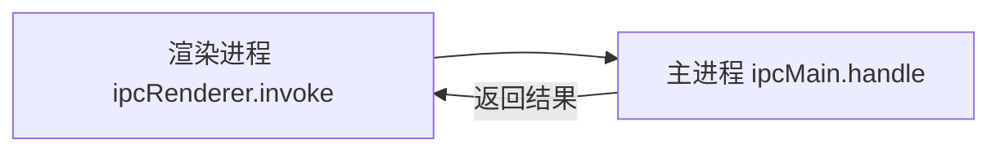

# 进程

## 有哪些进程


Electron 中主要控制两类进程：主进程、渲染器进程。

### 主进程

每个 Electron 应用都有一个单一的主进程，作为应用程序的入口点。 主进程在 Node.js 环境中运行，它具有 require 模块和使用所有 Node.js API 的能力。

[主进程](https://www.electronjs.org/zh/docs/latest/tutorial/process-model#%E4%B8%BB%E8%BF%9B%E7%A8%8B)的核心就是：使用 BrowserWindow 来创建和管理窗口。

### 渲染进程

每个 BrowserWindow 实例都对应一个单独的渲染器进程，运行在[渲染器进程](https://www.electronjs.org/zh/docs/latest/tutorial/process-model#%E6%B8%B2%E6%9F%93%E5%99%A8%E8%BF%9B%E7%A8%8B)中的代码，必须遵守网页标准。 这也就意味着：渲染器进程无权直接访问 require 或使用任何 Node.js的API。

::: warning 问题产生
处于渲染器进程的用户界面，该怎样才与 Node.js 和 Electron的原生桌面功能进行交互呢？
:::

### 预加载脚本

[预加载（preload）脚本](https://www.electronjs.org/zh/docs/latest/tutorial/process-model#preload-%E8%84%9A%E6%9C%AC)包含了那些执行于渲染器进程中，且先于网页内容开始加载的代码 。这些脚本虽运行于渲染器的环境中，却因能访问 Node.js API 而拥有了更多的权限。可以访问 Node.js 的 API，同时又可以与网页内容进行安全的交互。简单说：它是 Node.js 和 Web API 的桥梁，Preload 脚本可以安全地将部分 Node.js 功能暴露给网页，从而减少安全风险。

| 进程 | 数量 | 环境 | 执行顺序 |
| ---- | ---- | ---- | ---- |
| 主进程 | 1 | Node.js | 最先执行 |
| 预加载脚本 | 1 | 浏览器（可以访问部分 Node.js API） | 在渲染进程之前执行 |
| 渲染进程 | 多个 | 浏览器 | 最后执行 |

#### 将预加载脚本与主进程关联

要想将预加载脚本（`preload.js`）与主进程关联，需要在 `main.js` 中，通过 `webPreferences` 配置预加载脚本。

```js
const path = require('node:path')

function createWindow() {
  const win = new BrowserWindow({
    width: 800, // 窗口宽度
    height: 600, // 窗口高度
    autoHideMenuBar: true, // 自动隐藏菜单栏
    alwaysOnTop: true, // 置顶
    webPreferences: { // [!code ++]
      preload: path.join(__dirname, './preload.js') // [!code ++]
    } // [!code ++]
  })

  // 加载一个远程页面
  win.loadURL('https://www.baidu.com/')
}
```

#### 将预加载脚本与渲染进程关联

首先将预加载脚本与主进程关联起来，然后在预加载脚本中**暴露**数据给渲染进程。

::: code-group

```js [preload.js]
const { contextBridge } = require('electron')

console.log('preload.js')

// 暴露数据给渲染进程
contextBridge.exposeInMainWorld('a', {
  name: 'Jack',
  age: 20,
  version: process.version,
  sayHello: () => {
    return 'Hello, world!'
  }
})
```

```js [pages/index.js]
const btn = document.querySelector('.btn')

btn.addEventListener('click', () => {
  console.log(a)
})
```
:::


## 进程间通信（IPC）

[进程间通信 (IPC)](https://www.electronjs.org/zh/docs/latest/tutorial/ipc) 是在 Electron 中构建功能丰富的桌面应用程序的关键部分之一。 由于主进程和渲染器进程在 Electron 的进程模型具有不同的职责，因此 IPC 是执行许多常见任务的唯一方法，例如从 UI 调用原生 API 或从原生菜单触发 Web 内容的更改。

由于预加载脚本，无法使用全部的 Node.js API，比如：不能使用 `fs` 模块，但主进程是可以的，这时就需要进程通信了。简单说：要让 `preload.js` 通知 `main.js` 去调用 `fs` 模块干活。

::: tip 关于 `Electron` 进程通信，我们要知道：

- `IPC` 全称为：`InterProcess Communication`，即：进程通信。
- `IPC`是 `Electron` 中最为核心的内容，它是从 `UI` 调用原生 `API` 的唯一方法！
- `Electron` 中，主要使用 [ipcMain](https://www.electronjs.org/zh/docs/latest/api/ipc-main) 和 [ipcRenderer](https://www.electronjs.org/zh/docs/latest/api/ipc-renderer) 来定义“通道”，进行进程通信。
:::

### 渲染进程➡️主进程（单向）


要将单向 IPC 消息从渲染器进程发送到主进程，您可以使用 [ipcRenderer.send](https://www.electronjs.org/zh/docs/latest/api/ipc-renderer) API 发送消息，然后使用 [ipcMain.on](https://www.electronjs.org/zh/docs/latest/api/ipc-main) API接收。

常用于：在 Web 中调用主进程的 API，例如下面的这个需求：

点击按钮后，在用户的 D 盘创建一个`hello.txt`文件，文件内容来自于用户输入。

::: code-group

```html [pages/index.html]
<body>
  <h1>Electron</h1>
  <input class="ipt" type="text">
  <button class="btn">点击我创建文件</button>
  <script>
    const btn = document.querySelector('.btn')
    const ipt = document.querySelector('.ipt')

    btn.addEventListener('click', () => {
      // 调用预加载脚本暴露给的函数，并把 input 输入的内容传递给函数
      myAPI.saveFile(ipt.value)
    })
  </script>
</body>
```

```js [preload.js]
const { contextBridge, ipcRenderer } = require('electron')

// 暴露一个函数给渲染进程
contextBridge.exposeInMainWorld('myAPI', {
  saveFile: (str) => {
    // 给主进程发送一个消息，并携带渲染进程给的数据
    ipcRenderer.send('create-file', str)
  }
})
```

```js [main.js]
const path = require('node:path')
const fs = require('node:fs')
const { app, BrowserWindow, ipcMain } = require('electron')

// 用于创建窗口
function createWindow() {
  const win = new BrowserWindow({
    /** 其他配置项 */
    webPreferences: {
      preload: path.resolve(__dirname, './preload.js')
    }
  })

  // 主进程注册对应回调
  ipcMain.on('create-file', createFile)

  // 加载一个本地页面
  win.loadFile('pages/index.html')
}

// 用于创建文件
function createFile(event, data) {
  fs.writeFileSync('D:/hello.txt', data)
}

// 当app准备好后，执行createWindow函数
app.on('ready', () => {
  createWindow()
})
```

:::

### 渲染进程↔主进程（双向）



概述：双向 IPC 的一个常见应用是从渲染器进程代码调用主进程模块并等待结果。

:::tip 提示
 - 渲染进程通过 [ipcRenderer.invoke](https://www.electronjs.org/zh/docs/latest/api/ipc-renderer##ipcrendererinvokechannel-args) 发送消息
 - 主进程使用 [ipcMain.handle](https://www.electronjs.org/zh/docs/latest/api/ipc-main##ipcmainhandlechannel-listener) 接收并处理消息。
 - 备注：`ipcRender.invoke` 的返回值是 `Promise` 实例。
:::

常用于：从渲染器进程调用主进程方法并等待结果，例如下面的这个需求：

点击按钮从 D 盘读取 `hello.txt`中的内容，并将结果呈现在页面控制台打印。

::: code-group

```html [pages/index.html]
<button class="read">读取用户D盘的hello.txt</button>

<script>
  const read = document.querySelector('.read')

  read.addEventListener('click', async () => {
    const data = await myAPI.readFile()
    console.log(data)
  })
</script>
```

```js [preload.js]
const { contextBridge, ipcRenderer } = require('electron')

contextBridge.exposeInMainWorld('myAPI', {
  readFile: () => {
    return ipcRenderer.invoke('read-file')
  }
})
```

```js [main.js]
// 用于创建窗口
function createWindow() {
  // 主进程注册对应回调
  ipcMain.handle('read-file', readFile)

  // 加载一个本地页面
  win.loadFile('pages/index.html')
}

// 读取文件
function readFile() {
  return fs.readFileSync('D:/hello.txt').toString()
}
```

:::

### 主进程到➡️渲染进程（单向）


概述：主进程使用 win.webContents.send 发送消息，渲染进程通过ipcRenderer.on 处理消息，

常用于：从主进程主动发送消息给渲染进程，例如下面的这个需求：

应用加载 6 秒钟后，主动给渲染进程发送一个消息，内容是：你好啊！

::: code-group

```js [pages/index.html]
<script>
  window.onload = () => {
    myAPI.getMessage((event, str) => {
      console.log(event, str)
    })
  }
</script>
```

```js [preload.js]
const { contextBridge, ipcRenderer } = require('electron')

contextBridge.exposeInMainWorld('myAPI', {
  getMessage: (callback) => {
    return ipcRenderer.on('message', callback)
  }
})
```

```js [main.js]
// 用于创建窗口
function createWindow() {
  /**********/
  // 加载一个本地页面
  win.loadFile('pages/index.html')
  // 创建一个定时器
  setTimeout(() => {
    win.webContents.send('message', '你好啊！')
  }, 6000)
}
```

:::
